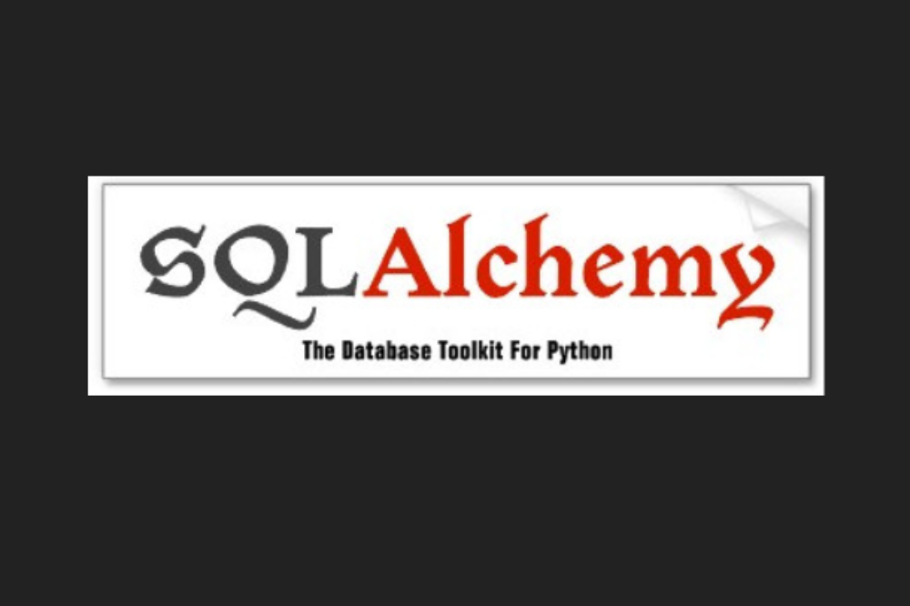

**สารบัญ**  
  
๛ แนวคิดการควบคุมฐานข้อมูลในรูปออบเจ็กต์  
๛ การติดตั้ง  
๛ การเริ่มต้นเชื่อมต่อกับฐานข้อมูลเพื่อเตรียมการใช้งาน  
๛ การสร้างคลาสตารางข้อมูล  
๛ การเตรียมไฟล์แบบจำลองและตัวสร้างเซสชัน  
๛ การเพิ่มข้อมูลลงไป  
๛ การอ่านข้อมูลในตาราง (query)  
๛ การอ่านข้อมูลทั้งหมดใส่ลิสต์ (all)  
๛ การกำหนดวิธีการเรียงลำดับข้อมูล (order_by)  
๛ การเอาข้อมูลเฉพาะตัวแรกตัวเดียว (first)  
๛ การจำกัดเอาข้อมูลเฉพาะบางส่วน (limit และ offset)  
๛ การกำหนดเงื่อนไขข้อมูลที่จะอ่าน (filter)  
๛ การแก้ข้อมูล (update)  
๛ การลบข้อมูลออก (delete)  
๛ การย้อนคืนสิ่งที่ทำกลับไป (rollback)  
๛ การป้อนคำสั่ง SQL ใส่โดยตรง (execute)

**sqlalchemy** เป็นมอดูลในไพธอนที่ใช้สำหรับเชื่อมต่อกับระบบจัดการฐานข้อมูล SQL โดยควบคุมฐานข้อมูลในรูปแบบที่สั่งข้อมูลเหมือนเป็นออบเจ็กต์ตามแนวคิดเชิงวัตถุ  
  
บทความนี้จะอธิบายแนวคิดเบื้องต้นและวิธีการใช้ sqlalchemy เพื่อจัดการกับฐานข้อมูลอย่างง่าย  
  
**แนวคิดการควบคุมฐานข้อมูลในรูปออบเจ็กต์介**  
  
ปกติการเชื่อมต่อกับฐานข้อมูล SQL จะทำโดยใช้โค้ดคำสั่งภาษา SQL แม้ว่าบางทีอาจไม่ได้สั่งโดยตรงแต่ผ่านตัวกลางอะไรก็ตาม  
  
ไพธอนมีมอดูลมาตรฐานที่ใช้จัดการฐานข้อมูลอยู่แล้วคือ sqlite3 อย่างไรก็ตาม มอดูลนี้เป็นแค่ตัวกลางสำหรับส่งโค้ดคำสั่ง SQL เข้าไปสั่งฐานข้อมูลเท่านั้น เรายังคงต้องเขียนโค้ดควบคุมด้วยตัวเอง  
  
เกี่ยวกับการใช้ sqlite3 ได้เขียนถึงไปใน >> [https://phyblas.hinaboshi.com/20200519](https://phyblas.hinaboshi.com/20200519)  
  
แต่หากใช้ sqlalchemy แม้จะใช้ควบคุมฐานข้อมูล SQL เหมือนกัน แต่ใช้วิธีการต่างกัน คือ sqlalchemy จะเป็นการควบคุมทางอ้อม เรามักจะไม่ต้องพิมพ์โค้ดคำสั่ง SQL เองโดยตรง  
  
วิธีการของ sqlalchemy คือมองว่าตารางข้อมูลในฐานข้อมูลนั้นเป็นออบเจ็กต์ตัวหนึ่ง โดยออบเจ็กต์นั้นจะมีฟังก์ชันหรือเมธอดต่างๆซึ่งเมื่อใช้แล้วจะไปสร้างโค้ดคำสั่ง SQL สั่งฐานข้อมูลอีกที  
  
ดังนั้นแล้วการควบคุมออบเจ็กต์นั้นก็เป็นการควบคุมข้อมูลในฐานข้อมูล ถ้าเราต้องการดึงข้อมูลในฐานข้อมูลมาอ่าน sqlalchemy ก็จะไปสร้างคำสั่งดึงข้อมูลมาให้ ถ้าเราทำความเปลี่ยนแปลงอะไรกับออบเจ็กต์ มันก็จะไปเปลี่ยนแปลงตัวข้อมูลในฐานข้อมูลด้วยโดยอัตโนมัติ  
  
การที่ทำแบบนี้ได้เพราะในตัวมอดูล sqlalchemy นั้นมีการตั้งความเชื่อมโยงระหว่างการกระทำต่อตัวออบเจ็กต์ กับคำสั่ง SQL สำหรับสั่งฐานข้อมูล  
  
แนวคิดแบบนี้เรียกว่า**การจับคู่เชื่อมโยงระหว่างเชิงวัตถุและเชิงสัมพันธ์ (Object-Relational mapping)** หรือมักเรียกย่อๆว่า **ORM**  
  
นอกจาก sqlalchemy แล้วในไพธอนก็ยังมีมอดูลตัวอื่นที่ทำคล้ายๆกันนี้ เช่น [tortoise-orm](https://tortoise-orm.readthedocs.io/) รวมถึง [django](https://www.djangoproject.com/) ซึ่งเป็นมอดูลทำเฟรมเวิร์กเขียนเว็บ ก็มีมอดูลย่อยที่ควบคุมฐานข้อมูลแบบ ORM เช่นเดียวกัน  
  
sqlalchemy อาจใช้คู่กับมอดูลไพธอนสำหรับเขียนเว็บที่ไม่ได้มี ORM อยู่ในตัวสำเร็จเหมือนอย่างที่ django มีแบบนั้น เช่น flask หรือ responder  
  
หากเทียบกับในภาษารูบีก็เหมือนกับมอดูล activerecord ซึ่งมักจะใช้คู่กับ ruby on rails เฟรมเวิร์กเขียนเว็บยอดนิยมตัวหนึ่ง  
  
sqlalchemy อาจใช้ได้กับฐานข้อมูลต่างๆเหล่านี้  

-   SQLite
-   MySQL
-   PostgreSQL
-   Oracle
-   Mycrosoft SQL Server
-   Firebird
-   Sybase

ซึ่งฐานข้อมูลแต่ละตัวนั้นก็จะมีลักษณะการเขียนที่ต่างกันออกไป และ sqlalchemy ช่วยรองรับความแตกต่างนี้ให้ได้ในระดับหนึ่ง อย่างไรก็ตามความต่างนี้ก็ส่งผลอยู่บ้าง แต่พวกคำสั่งพื้นฐานจะใช้ได้ไม่ต่างกันนัก  
  
ในบทความนี้จะใช้ SQLite เป็นตัวอย่าง แต่วิธีการสามารถนำไปใช้กับฐานข้อมูลชนิดอื่นได้เช่นกัน แม้อาจมีรายละเอียดหรือผลลัพธ์ต่างกันออกไปบ้าง  
  
เมื่อใช้ sqlalchemy แล้วจะทำให้เราอ่านเขียนข้อมูลในฐานข้อมูล SQL ได้โดยไม่ต้องเขียนโค้ดภาษา SQL โดยตรงเลย เพียงแต่ในเบื้องหลังการทำงานของมันจริงๆแล้วก็คือสร้างโค้ด SQL โดยอัตโนมัติเพื่อไปสั่งอีกที ดังนั้นก็ยังควรจะรู้โค้ด SQL อยู่ เมื่อมีปัญหาจะได้เข้าใจว่าเกิดอะไรขึ้น อีกทั้งคำสั่งลึกๆซับซ้อนจำเพาะบางอย่างเขียนโค้ด SQL สั่งเองอาจจะเร็วกว่าด้วย  
  
ปกติเวลาเกิดข้อผิดพลาดอะไรขึ้นระหว่างติดต่อกับฐานข้อมูลอยู่ sqlalchemy ก็จะแสดงโค้ด SQL ที่ใช้ตอนนั้นให้ดูไปด้วย สามารถดูโค้ดเพื่อให้เข้าใจได้มากขึ้นว่ามีข้อผิดพลาดอะไร  
  
  
  
  
**การติดตั้ง介**  
  
sqlalchemy ไม่ใช่มอดูลมาตรฐานของไพธอน ต้องติดตั้งเพิ่มเติมเอง ซึ่งก็ทำได้ง่ายโดยใช้ pip  
```py
pip install SQLAlchemy
```
  
หรือ conda  
```py
conda install -c anaconda sqlalchemy
```
  
  
  
  
**การเริ่มต้นเชื่อมต่อกับฐานข้อมูลเพื่อเตรียมการใช้งาน介**  
  
ขอเริ่มด้วยการยกตัวอย่างการใช้ sqlalchemy ทำการเชื่อมต่อกับฐานข้อมูล สร้างตารางข้อมูลในนั้น จากนั้นเติมข้อมูลในตาราง และสุดท้ายคือดูข้อมูลในตาราง  

```python
import sqlalchemy
from sqlalchemy.orm import sessionmaker
from sqlalchemy.ext.declarative import declarative_base

# สร้างคลาสแบบจำลองพื้นฐาน
Base = declarative_base()

# สร้างคลาสตารางฐานข้อมูลนักเรียน
class Nakrian(Base):
    __tablename__ = 'nakrian'
    chue = sqlalchemy.Column(sqlalchemy.String,primary_key=True)
    ayu = sqlalchemy.Column(sqlalchemy.Integer)
    sung = sqlalchemy.Column(sqlalchemy.Float)
    
    def __repr__(self):
        return f'{self.chue} อายุ {self.ayu} สูง {self.sung*100:.0f} ซม.'

# สร้างตัวเชื่อมต่อกับฐานข้อมูล sqlite ในไฟล์ yurudata.db
engine = sqlalchemy.create_engine('sqlite:///yurudata.db')

# ทำการสร้างตารางขึ้นมาในฐานข้อมูล SQL จริงๆ
Base.metadata.create_all(engine)

# สร้างเซชชัน
sm = sessionmaker(engine)
session = sm()


# เข้าสู่ขั้นตอนใช้งาน

# สร้างออบเจ็กต์นักเรียนคนแรก
nakrian1 = Nakrian(chue='ริเสะ',ayu=15,sung=1.46)
# ใส่นักเรียนคนแรกลงในฐานข้อมูล
session.add(nakrian1)

# สร้างออบเจ็กต์นักเรียนคนที่ ๒ และ ๓
nakrian2 = Nakrian(chue='อายาโนะ',ayu=14,sung=1.59)
nakrian3 = Nakrian(chue='ซากุราโกะ',ayu=13,sung=1.53)
# ใส่นักเรียนคนที่ ๒ และ ๓ ลงในฐานข้อมูลพร้อมกันทีเดียว
session.bulk_save_objects([nakrian2,nakrian3])

# บันทึกความเปลี่ยนแปลงลงในฐานข้อมูลจริงๆ
session.commit()

# เปิดดูข้อมูลทั้งหมดในฐานข้อมูล
for nakrian in session.query(Nakrian).order_by(Nakrian.ayu):
    print(nakrian)
```

  
ผลที่ได้  

```javascript
ซากุราโกะ อายุ 13 สูง 153 ซม.
อายาโนะ อายุ 14 สูง 159 ซม.
ริเสะ อายุ 15 สูง 146 ซม.
```

  
จากตัวอย่างจะเห็นว่าขั้นตอนการเตรียมการใช้งานโดยรวมก็จะมีอยู่ดังนี้  
  

-   สร้างคลาสแบบจำลองพื้นฐาน (Base) จาก sqlalchemy.ext.declarative.declarative_base()
  
-   สร้างคลาสตารางฐานข้อมูลนักเรียนขึ้นมาโดยรับทอดจากแบบจำลองพื้นฐานนั้น
  
-   สร้างออบเจ็กต์ตัวเชื่อมต่อกับฐานข้อมูล (ใน sqlalchemy จะเรียกว่าเป็น engine หรือเครื่องยนต์) โดยใช้ sqlalchemy.create_engine() แล้วระบุชื่อฐานข้อมูลที่จะเชื่อมต่อ  
      
    ในกรณีของ SQLite ดังตัวอย่างนี้จะเขียนเป็น sqlalchemy.create_engine('sqlite:///พาธและชื่อไฟล์ฐานข้อมูล')
  
-   สร้างตารางขึ้นตามแบบจำลองที่สร้างไว้ Base.metadata.create_all(engine)
  
-   สร้างตัวสร้างเซชชันขึ้นมาจาก sqlalchemy.orm.sessionmaker()
  
-   สร้างเซชชันขึ้นมาจากตัวสร้างเซชชัน
  

หลังจากนั้นก็เข้าสู่ขั้นตอนการนำมาใช้งานได้ โดยสิ่งที่จะต้องใช้คือตัว session และตัวคลาสของตารางข้อมูลที่เราสร้างขึ้นมาจากขั้นเตรียมการ  
  
รายละเอียดในส่วนการใช้งานนั้นจะอธิบายอีกทีหลังในหัวข้อถัดๆไป  
  
ฟังก์ชันที่ใช้นั้นกระจัดกระจายอยู่ตามมอดูลย่อยต่างๆ ตัวหลักๆที่ใช้เป็นประจำมีดังนี้  

ชื่อฟังก์ชัน

หน้าที่

`sqlalchemy.create_engine`

สร้างตัวเชื่อมต่อกับฐานข้อมูล

`sqlalchemy.orm.sessionmaker`

ตัวสร้างเซสชันการเชื่อมต่อ

`sqlalchemy.ext.declarative.declarative_base`

ตัวสร้างคลาสที่เป็นฐานของแบบจำลองตารางข้อมูล

`sqlalchemy.Column`

สร้างออบเจ็กต์ที่แทนสดมภ์ของตารางข้อมูล

`sqlalchemy.String`  
`sqlalchemy.Integer`  
`sqlalchemy.Float`  
ฯลฯ

คลาสแทนชนิดข้อมูล สายอักขระ, เลขจำนวนเต็ม, เลขทศนิยม, ฯลฯ

  
การแค่ import sqlalchemy เข้ามาอย่างเดียวไม่ได้ทำให้สามารถเรียกใช้พวก sqlalchemy.orm.sessionmaker() หรือ sqlalchemy.ext.declarative.declarative_base() ซึ่งอยู่ภายในมอดูลย่อยได้ ดังนั้นจึงต้องเขียน from import แยกออกมาอีกที  
  
  
  
  
**การสร้างคลาสตารางข้อมูล介**  
  
ในส่วนของขั้นตอนการเตรียมตัวดังที่ยกตัวอย่างมาแล้วนั้น ขั้นตอนที่ดูจะซับซ้อนและต้องปรับแต่งอะไรมากที่สุดก็คือการสร้างคลาสของตารางข้อมูล  
  
เวลาสร้างคลาสนี้ขึ้นจะสร้างโดยรับทอดจากคลาส Base ซึ่งสร้างขึ้นมาจาก sqlalchemy.ext.declarative.declarative_base() อีกที  
  
ตัวอย่าง สร้างตารางข้อมูลผู้กล้าซึ่งมี ๓ สดมภ์คือ chue (ชื่อ), lv, hp  

```python
import sqlalchemy
from sqlalchemy.ext.declarative import declarative_base

Basemodel = declarative_base()

class Phukla(Basemodel):
    __tablename__ = 'phukla'
    chue = sqlalchemy.Column(sqlalchemy.String(32),primary_key=True)
    lv = sqlalchemy.Column(sqlalchemy.Integer)
    hp = sqlalchemy.Column(sqlalchemy.Float)
    
    def __repr__(self):
        return f'{self.chue} lv: {self.lv} hp: {self.hp}'

engine = sqlalchemy.create_engine('sqlite:///pukla.db')
Basemodel.metadata.create_all(engine)
```

  
sqlalchemy.Column() คือคลาสที่ใช้สร้างออบเจ็กต์สดมภ์ (column) ของตารางข้อมูล ต้องการให้ตารางมีข้อมูลอะไรบ้างก็ใส่ไปตามนั้น โดยในวงเล็บจะเป็นตัวกำหนดคุณสมบัติของสดมภ์นั้น ที่สำคัญที่สุดก็คือชนิดของข้อมูล ก็ให้ใส่โดยใช้ตัวคลาสที่เตรียมไว้ในตัวมอดูล sqlalchemy ได้แก่ String (สายอักขระ), Integer (เลขจำนวนเต็ม), Float (เลขทศนิยม), ฯลฯ  
  
สำหรับสายอักขระ หากต้องการจำกัดจำนวนตัวอักษรก็ใส่วงเล็บต่อ เช่น sqlalchemy.String(20) แบบนี้ แต่จะไม่ใส่ก็ได้  
  
นอกจากนี้หากต้องการให้สดมภ์ไหนเป็นไพรมารีคีย์ (สดมภ์ที่สำคัญที่สุดในตาราง และจะให้มีค่าซ้ำกันไม่ได้) ก็ใส่ primary_key=True ลงไป  
  
ในการใช้ sqlalchemy จำเป็นต้องกำหนดสดมภ์สักตัวหนึ่งให้เป็นไพรมารีคีย์เสมอ  
  
ปกติแล้วแค่กำหนดคอลัมน์ลงไปแบบนี้ ตอนที่สั่งสร้างอินสแตนซ์ขึ้นมาก็ใส่ชื่อสดมภ์ต่างๆเหล่านั้นลงไปเป็นคีย์เวิร์ด  

```python
phukla1 = Phukla(chue='ได',lv=99,hp=999)
print(phukla1) # ได้ ได lv: 99 hp: 999
```

  
ตรงส่วน __repr__ นี้ใส่ลงไปเพื่อกำหนดว่าเวลาสั่ง print ขึ้นมาจะให้แสดงค่าเป็นแบบไหน อาจจะไม่ได้จำเป็นต้องใส่ แต่สะดวกเวลาแสดงผล จะได้รู้ว่าข้อมูลตัวนี้เป็นตัวไหน มีค่าอะไรอย่างไร  
  
หากไม่เขียน __repr__ เมื่อสั่ง print ก็คงจะออกมาในลักษณะแบบนี้  

```javascript
<__main__.Phukla at 0x11b2a5090>
```

  
ซึ่งก็ไม่ได้แสดงข้อมูลในนี้ให้เห็นโดยตรง จึงอาจจะไม่สะดวก ดังนั้นตัวอย่างต่อจากนี้ไปก็จะใส่ __repr__ ไปด้วยตลอด  
  
นอกจากนี้แล้วอาจกำหนดตรงส่วนของ __init__ เพื่อให้ตอนสร้างง่ายขึ้นหน่อย เช่นแค่ใส่เป็นอาร์กิวเมนต์ลงไปตามลำดับ รวมทั้งกำหนดค่าเริ่มต้นให้ได้ด้วย เช่น  

```python
class Nangsue(Basemodel):
    __tablename__ = 'nangsue'
    chue = sqlalchemy.Column(sqlalchemy.String,primary_key=True)
    chamnuanna = sqlalchemy.Column(sqlalchemy.Integer)
    rakha = sqlalchemy.Column(sqlalchemy.Float)
    
    def __init__(self,chue,chamnuanna=100,rakha=200):
        self.chue = chue
        self.chamnuanna = chamnuanna
        self.rakha = rakha
    
    def __repr__(self):
        return f'หนังสือชื่อ "{self.chue}" มี {self.chamnuanna} หน้า ราคา {self.rakha} บาท'

ns = Nangsue('สอนแมวเขียนโปรแกรม',400)
print(ns) # ได้ หนังสือชื่อ "สอนแมวเขียนโปรแกรม" มี 400 หน้า ราคา 200 บาท
```

  
นอกจากนี้ขั้นตอนสำคัญอีกอย่างก็คือการทำให้ตารางถูกสร้างขึ้นมาจริงๆในฐานข้อมูลด้วย  
  
การสร้างคลาสขึ้นมานั้นยังไม่ได้ทำให้ตารางถูกสร้างขึ้นมาในฐานข้อมูลจริงๆทันที ก่อนจะใช้งานจริงต้องสั่งสร้างตารางก่อน ซึ่งทำได้โดยสั่ง Base.metadata.create_all()  
  
Base นี้ก็คือตัวคลาสฐานที่ใช้ตอนรับทอดคลาสตารางข้อมูลนี้มา หากมีข้อมูลที่อยากให้สร้างขึ้นมาพร้อมกันก็ให้รับทอดจาก Base อันนี้เหมือนกัน แล้วเมื่อสั่ง .metadata.create_all() ก็จะสร้างขึ้นมาใหม่ทั้งหมด ถ้าหากยังไม่ได้มีอยู่ก่อน แต่ถ้าอันไหนมีแล้วก็จะไม่เกิดอะไรขึ้น  
  
ในทางกลับกัน ถ้าหากต้องการลบตารางข้อมูลทั้งหมดในฐานนั้นก็สั่ง Base.metadata.drop_all()  
  
  
  
  
**การเตรียมไฟล์แบบจำลองและตัวสร้างเซสชัน介**  
  
นอกจากตัวคลาสแบบจำลองแล้ว อีกสิ่งที่ต้องเตรียมการก็คือเซสชัน (session) ซึ่งสร้างจาก sqlalchemy.orm.sessionmaker  
  
เซสชันเป็นตัวกลางเชื่อมต่อกับ engine อีกที เวลาสร้าง sessionmaker ให้ใส่ engine ที่จะทำการเชื่อมต่อลงไป  
  
สิ่งที่ได้จาก sessionmaker คือตัวคลาสที่เอาไว้สร้างเซสชันอีกที ยังไม่ใช่ตัวเซสชัน ต้องเอามาเรียกใช้โดยสั่ง () เพื่อสร้างเซสชันอีกที  
  
ปกติแล้วส่วนของแบบจำลองและส่วนสร้างเซสชันอาจจะถูกเก็บไว้ในไฟล์หนึ่ง แล้วก็ให้เรียกใช้ไฟล์นั้นขึ้นมาในฐานะมอดูล โดย import เอาตัวคลาสและเซสชันมาใช้  
  
เพื่อเป็นตัวอย่างสำหรับหัวข้อถัดๆไป ขอสร้างแบบจำลองและเซสชันนี้ขึ้นมาใส่ในไฟล์ชื่อ pkmoses.py  

```python
import sqlalchemy
from sqlalchemy.orm import sessionmaker
from sqlalchemy.ext.declarative import declarative_base

Basemodel = declarative_base()

class Pokemon(Basemodel):
    __tablename__ = 'pokemon'
    lek = sqlalchemy.Column(sqlalchemy.Integer,primary_key=True)
    chue = sqlalchemy.Column(sqlalchemy.String(32))
    nak = sqlalchemy.Column(sqlalchemy.Float)
    sung = sqlalchemy.Column(sqlalchemy.Float)
    
    def __init__(self,lek,chue,nak,sung):
        self.lek = lek
        self.chue = chue
        self.nak = nak
        self.sung = sung
    
    def __repr__(self):
        return f'{self.lek}. {self.chue} หนัก {self.nak} สูง {self.sung*100:.0f} ซม.'

engine = sqlalchemy.create_engine('sqlite:///pkdata.db')
Basemodel.metadata.create_all(engine)

Session = sessionmaker(engine)
session = Session()
```

  
ข้อมูลในตารางนี้ก็คือข้อมูล pokemon ซึ่งมี ๔ สดมภ์ ได้แก่ lek (เลข), chue (ชื่อ), nak (หนัก), sung (สูง) โดยใช้เลขเป็นไพรมารีคีย์  
  
  
  
  
**การเพิ่มข้อมูลลงไป介**  
  
หลังจากขั้นตอนการสร้างตาราง ก็เข้าสู่ขั้นตอนการใช้งาน โดยคำสั่งพื้นฐานที่สุดก็คือการใส่ข้อมูลเข้าไป  
  
การใส่ข้อมูลอาจมีขั้นตอนดังนี้  
  

-   สร้างออบเจ็กต์ที่เป็นอินสแตนซ์ของคลาสตารางข้อมูลขึ้นมา
  
-   ใส่ข้อมูลลงในฐานข้อมูลจริงๆ โดยใช้ session.add (ถ้ามีตัวเดียว) หรือ session.add_all หรือ session.bulk_save_objects (ถ้ามีหลายตัว)
  
-   session.commit() เพื่อให้ข้อมูลถูกบันทึกไปจริงๆ
  

  
ตัวอย่างการใช้งาน ให้ import ตัวคลาสแบบจำลองและ session จาก pkmoses ที่สร้างขึ้นมาจากไฟล์ที่สร้างจากในหัวข้อที่แล้ว แล้วเพิ่มข้อมูลลงไปตัวหนึ่งด้วย .add()  

```python
from pkmoses import session,Pokemon

poke1 = Pokemon(152,'ชิโครีตา',6.4,0.9)
session.add(poke1)
session.commit()
```

  
หากต้องการเพิ่มทีละหลายตัวอาจใช้ .add_all() หรือ .bulk_save_objects() ก็ได้  

```python
poke2 = Pokemon(155,'ฮิโนอาราชิ',7.9,0.5)
poke3 = Pokemon(158,'วานิโนโกะ',9.5,0.6)
session.bulk_save_objects([poke2,poke3])
session.commit()

poke4 = Pokemon(153,'เบย์ลีฟ',15.8,1.2)
poke5 = Pokemon(154,'เมกาเนียม',100.5,1.8)
session.add_all([poke4,poke5])
session.commit()
```

  
เพียงแต่ข้อแตกต่างก็คือ .add_all() จะเป็นการสั่งให้วนซ้ำเพิ่มข้อมูลเข้าไปทีละตัวตามลำดับ ส่วน .bulk_save_objects() จะทำไปพร้อมกันและจะรวดเร็วกว่า  
  
ดังนั้นถ้าต้องการความรวดเร็วใช้ .bulk_save_objects() จะเร็วกว่า เพียงแต่เนื่องจากข้อมูลอาจถูกใส่อย่างไม่เป็นลำดับถูกต้อง ดังนั้นหากให้ความสำคัญกับลำดับของข้อมูลก็อาจใช้ .add_all()  
  
หลังสั่งเพิ่มข้อมูลทั้งหมดลงไปแล้วต้องสั่ง .commit() หากไม่มีการสั่ง .commit() ไปแม้จะใช้ .add() หรือ .add_all() หรือ .bulk_save_objects() ลงไปแล้วก็จะไม่มีการบันทึกลงไปจริงๆ  
  
อย่างไรก็ตาม หากต้องการให้มีการบันทึกไปเลยโดยอัตโนมัติทุกครั้งไม่ต้องมาสั่ง .commit() ก็ทำได้โดยตอนที่สร้างตัวสร้างเซสชันขึ้นให้ใส่เป็น sessionmaker(autocommit=True) ไป ก็เป็นวิธีหนึ่งที่ทำได้  
  
หากเพิ่มข้อมูลไปแล้วแต่ยังไม่ได้ .commit() แล้วต้องการยกเลิกความเปลี่ยนแปลงนั้นก็สามารถทำได้โดยใช้ .rollback()  
  
  
  
  
**การอ่านข้อมูลในตาราง (query)介**  
  
การอ่านข้อมูลที่อยู่ในตารางทำได้โดยใช้เมธอด .query() โดยใส่คลาสของตารางนั้นลงไป  
  
ข้อมูลที่อ่านขึ้นมาสามารถนำมาใช้วนด้วย for เพื่อเอาค่าทีละตัวก็ได้  
  
ตัวอย่างการอ่านข้อมูล  

```python
for pk in session.query(Pokemon):
    print(pk)
```

  
ได้  

```javascript
152. ชิโครีตา หนัก 6.4 สูง 90 ซม.
153. เบย์ลีฟ หนัก 15.8 สูง 120 ซม.
154. เมกาเนียม หนัก 100.5 สูง 180 ซม.
155. ฮิโนอาราชิ หนัก 7.9 สูง 50 ซม.
158. วานิโนโกะ หนัก 9.5 สูง 60 ซม.
```

  
กรณีที่ต้องการเอาข้อมูลแค่เฉพาะบางสดมภ์ให้ให้ใส่ตัวแอตทริบิวต์ที่เป็นชื่อตัวคอลัมน์ลงไปทีละตัวตามที่ต้องการ  

```python
for pk in session.query(Pokemon.lek,Pokemon.chue):
    print(pk)
```

  
ได้  

```javascript
(152, 'ชิโครีตา')
(153, 'เบย์ลีฟ')
(154, 'เมกาเนียม')
(155, 'ฮิโนอาราชิ')
(158, 'วานิโนโกะ')
```

  
  
  
  
**การอ่านข้อมูลทั้งหมดใส่ลิสต์ (all)介**  
  
วิธีการอ่านข้อมูลจากในตารางนอกจากจะใช้วนใน for แล้วก็ยังอาจจะใช้ .all() เพื่อดึงข้อมูลมาทั้งหมดทีเดียวเป็นลิสต์ก็ได้  

```python
print(session.query(Pokemon).all())
print(session.query(Pokemon.lek,Pokemon.chue).all())
```

  
ได้  

```javascript
[152. ชิโครีตา หนัก 6.4 สูง 90 ซม., 153. เบย์ลีฟ หนัก 15.8 สูง 120 ซม., 154. เมกาเนียม หนัก 100.5 สูง 180 ซม., 155. ฮิโนอาราชิ หนัก 7.9 สูง 50 ซม., 158. วานิโนโกะ หนัก 9.5 สูง 60 ซม.]
[(152, 'ชิโครีตา'), (153, 'เบย์ลีฟ'), (154, 'เมกาเนียม'), (155, 'ฮิโนอาราชิ'), (158, 'วานิโนโกะ')]
```

**การกำหนดวิธีการเรียงลำดับข้อมูล (order_by)介**  
  
สามารถกำหนดลำดับการเรียงข้อมูลที่ออกมาได้โดยใส่ .order_by() โดยระบุสดมภ์ที่ต้องการใช้เรียงลงไป เช่น  

```python
print(session.query(Pokemon).order_by(Pokemon.sung).all())
print(session.query(Pokemon).order_by(Pokemon.nak).all())
```

  
ได้  

```javascript
[155. ฮิโนอาราชิ หนัก 7.9 สูง 50 ซม., 158. วานิโนโกะ หนัก 9.5 สูง 60 ซม., 152. ชิโครีตา หนัก 6.4 สูง 90 ซม., 153. เบย์ลีฟ หนัก 15.8 สูง 120 ซม., 154. เมกาเนียม หนัก 100.5 สูง 180 ซม.]
[152. ชิโครีตา หนัก 6.4 สูง 90 ซม., 155. ฮิโนอาราชิ หนัก 7.9 สูง 50 ซม., 158. วานิโนโกะ หนัก 9.5 สูง 60 ซม., 153. เบย์ลีฟ หนัก 15.8 สูง 120 ซม., 154. เมกาเนียม หนัก 100.5 สูง 180 ซม.]
```

  
หากต้องการเรียงกลับด้านให้ใส่ .desc() เช่น  

```python
print(session.query(Pokemon).order_by(Pokemon.lek.desc()).all())
print(session.query(Pokemon).order_by(Pokemon.sung.desc()).all())
```

  
ได้  

```javascript
[158. วานิโนโกะ หนัก 9.5 สูง 60 ซม., 155. ฮิโนอาราชิ หนัก 7.9 สูง 50 ซม., 154. เมกาเนียม หนัก 100.5 สูง 180 ซม., 153. เบย์ลีฟ หนัก 15.8 สูง 120 ซม., 152. ชิโครีตา หนัก 6.4 สูง 90 ซม.]
[154. เมกาเนียม หนัก 100.5 สูง 180 ซม., 153. เบย์ลีฟ หนัก 15.8 สูง 120 ซม., 152. ชิโครีตา หนัก 6.4 สูง 90 ซม., 158. วานิโนโกะ หนัก 9.5 สูง 60 ซม., 155. ฮิโนอาราชิ หนัก 7.9 สูง 50 ซม.]
```

  
  
  
  
**การเอาข้อมูลเฉพาะตัวแรกตัวเดียว (first)介**  
  
หากต้องการข้อมูลเฉพาะแค่ตัวแรกให้ใช้ .first() เช่น  

```python
print(session.query(Pokemon).first())
# ได้ 152. ชิโครีตา หนัก 6.4 สูง 90 ซม.
print(session.query(Pokemon).order_by(Pokemon.sung).first())
# ได้ 155. ฮิโนอาราชิ หนัก 7.9 สูง 50 ซม.
print(session.query(Pokemon).order_by(Pokemon.nak.desc()).first())
# ได้ 154. เมกาเนียม หนัก 100.5 สูง 180 ซม.
```

  
  
  
  
**การจำกัดเอาข้อมูลเฉพาะบางส่วน (limit และ offset)介**  
  
ถ้าต้องการจำกัดจำนวนที่จะเอาให้ใช้ .limit() และกำหนดลำดับเริ่มต้นโดยใช้ .offset() เช่น  

```python
print(session.query(Pokemon).limit(3).all())
# ได้ [152. ชิโครีตา หนัก 6.4 สูง 90 ซม., 153. เบย์ลีฟ หนัก 15.8 สูง 120 ซม., 154. เมกาเนียม หนัก 100.5 สูง 180 ซม.]
print(session.query(Pokemon.lek).limit(4).all())
# ได้ [(152,), (153,), (154,), (155,)]
print(session.query(Pokemon).offset(2).all())
# ได้ [154. เมกาเนียม หนัก 100.5 สูง 180 ซม., 155. ฮิโนอาราชิ หนัก 7.9 สูง 50 ซม., 158. วานิโนโกะ หนัก 9.5 สูง 60 ซม.]
print(session.query(Pokemon).offset(1).limit(2).all())
# ได้ [153. เบย์ลีฟ หนัก 15.8 สูง 120 ซม., 154. เมกาเนียม หนัก 100.5 สูง 180 ซม.]
print(session.query(Pokemon).order_by(Pokemon.sung).limit(2).all())
# ได้ [155. ฮิโนอาราชิ หนัก 7.9 สูง 50 ซม., 158. วานิโนโกะ หนัก 9.5 สูง 60 ซม.]
```

  
ถ้าใช้ order_by เพื่อกำหนดรูปแบบการเรียงไปด้วยให้ใส่ order_by ก่อนค่อยตามด้วย offset และ limit  
  
  
  
  
**การกำหนดเงื่อนไขข้อมูลที่จะอ่าน (filter)介**  
  
สามารถกำหนดเงื่อนไขว่าจะเอาข้อมูลแค่บางส่วนที่ต้องการออกมาได้โดยใช้ .filter() เช่น  

```python
print(session.query(Pokemon).filter(Pokemon.nak<10).all())
# ได้ [152. ชิโครีตา หนัก 6.4 สูง 90 ซม., 155. ฮิโนอาราชิ หนัก 7.9 สูง 50 ซม., 158. วานิโนโกะ หนัก 9.5 สูง 60 ซม.]
print(session.query(Pokemon.chue).filter(Pokemon.chue!='เบย์ลีฟ').all())
# ได้ [('ชิโครีตา',), ('เมกาเนียม',), ('ฮิโนอาราชิ',), ('วานิโนโกะ',)]
```

  
สามารถใส่มากกว่าเงื่อนไขพร้อมกันได้ โดยจะมีความหมายเป็น "และ" คือต้องเข้าทุกเงื่อนไข  

```python
print(session.query(Pokemon).filter(Pokemon.nak>8,Pokemon.nak<20).all())
# ได้ [153. เบย์ลีฟ หนัก 15.8 สูง 120 ซม., 158. วานิโนโกะ หนัก 9.5 สูง 60 ซม.]
print(session.query(Pokemon.chue).filter(Pokemon.chue!='ชิโครีตา',Pokemon.chue!='เบย์ลีฟ').all())
# [('เมกาเนียม',), ('ฮิโนอาราชิ',), ('วานิโนโกะ',)]
```

  
นอกจากนี้ในการรวมหรือจัดการเงื่อนไขอาจใช้ and_, or_, not_ เพื่อแทน "และ", "หรือ", "ไม่"  

```python
print(session.query(Pokemon).filter(sqlalchemy.or_(Pokemon.chue=="เบย์ลีฟ",Pokemon.chue=="เมกาเนียม")).all())
# ได้ [153. เบย์ลีฟ หนัก 15.8 สูง 120 ซม., 154. เมกาเนียม หนัก 100.5 สูง 180 ซม.]
print(session.query(Pokemon.chue).filter(sqlalchemy.not_(Pokemon.chue=="ชิโครีตา")).all())
# ได้ [('เบย์ลีฟ',), ('เมกาเนียม',), ('ฮิโนอาราชิ',), ('วานิโนโกะ',)]
```

  
อนึ่ง สาเหตุที่ชื่อ and_, or_, not_ มี _ ต่อท้ายเพราะคำว่า and, or, not เป็นคำต้องห้ามในไพธอน ใช้เป็นชื่อตัวแปรไม่ได้เลยต้องเติม _  
  
นอกจากนี้เงื่อนไขที่เป็นตัวเลขอาจใช้ .between() เพื่อคัดเอาค่าที่อยู่ในช่วงได้  

```python
print(session.query(Pokemon).filter(Pokemon.nak.between(9,25)).all())
# ได้ [153. เบย์ลีฟ หนัก 15.8 สูง 120 ซม., 158. วานิโนโกะ หนัก 9.5 สูง 60 ซม.]
print(session.query(Pokemon).filter(Pokemon.lek.between(153,155)).all())
# ได้ [153. เบย์ลีฟ หนัก 15.8 สูง 120 ซม., 154. เมกาเนียม หนัก 100.5 สูง 180 ซม., 155. ฮิโนอาราชิ หนัก 7.9 สูง 50 ซม.]
```

  
ถ้าค่าเป็นสายอักขระอาจใช้ .contains() เพื่อคัดเอาที่มีคำที่ต้องการอยู่  

```python
print(session.query(Pokemon.chue).filter(Pokemon.chue.contains('โน')).all())
# ได้ [('ฮิโนอาราชิ',), ('วานิโนโกะ',)]
```

  
  
  
  
**การแก้ข้อมูล (update)介**  
  
การแก้ไขข้อมูลอาจทำโดยใช้ .query อ่านข้อมูลเข้ามา() แล้วเอามาแก้ แล้วก็ทำการ .commit() ข้อมูลในฐานข้อมูลก็จะถูกแก้ไปด้วยตามนั้น  

```python
pk1 = session.query(Pokemon).filter(Pokemon.chue=='ฮิโนอาราชิ').first()
pk1.lek = 156
pk1.chue = 'แม็กมาราชิ'
pk1.nak = 0.9
pk1.sung = 19
session.commit()
```

  
นอกจากนี้ก็อาจใช้เมธอด .update() ที่ตัวข้อมูลที่ใช้ .filter() คัดมา เพื่อสั่งแก้ข้อมูลโดยตรง เช่น  

```python
kha = {'lek':159,'chue':'อาลิเกตซ์','nak':1.1,'sung':25}
session.query(Pokemon).filter(Pokemon.chue=='วานิโนโกะ').update(kha)
session.commit()
```

  
  
  
  
**การลบข้อมูลออก (delete)介**  
  
การลบข้อมูลออกอาจทำโดยใช้ .query() ดึงข้อมูลที่ต้องการลบออกมา แล้วใช้เมธอด .delete() จากตัวเซสชัน แล้ว .commit()  

```python
pk2 = session.query(Pokemon).filter(Pokemon.chue=='เมกาเนียม').first()
session.delete(pk2)
session.commit()
```

  
นอกจากนี้อาจจะเรียกเมธอด .delete() จากตัว query โดยตรงเลยก็ได้ เช่น  

```python
session.query(Pokemon).filter(Pokemon.chue=='ชิโครีตา').delete()
session.commit()
```

  
  
  
  
**การย้อนคืนสิ่งที่ทำกลับไป (rollback)介**  
  
หากเพิ่มหรือแก้ไขหรือลบข้อมูลไปแล้วยังไม่ได้สั่ง .commit() ที่ตัวเซสชันอาจสามารถย้อนคืนกลับได้โดยใช้ .rollback()น  
  
ตัวอย่างการใช้  

```python
print(session.query(Pokemon).all())
# ได้ [153. เบย์ลีฟ หนัก 15.8 สูง 120 ซม., 156. แม็กมาราชิ หนัก 0.9 สูง 1900 ซม., 159. อาลิเกตซ์ หนัก 1.1 สูง 2500 ซม.]

kha = {'lek':157,'chue':'บักฟูน','nak':1.7,'sung':79.5}
session.query(Pokemon).filter(Pokemon.chue=='แม็กมาราชิ').update(kha)
session.query(Pokemon).filter(Pokemon.chue=='เบย์ลีฟ').delete()

print(session.query(Pokemon).all())
# ได้ [157. บักฟูน หนัก 1.7 สูง 7950 ซม., 159. อาลิเกตซ์ หนัก 1.1 สูง 2500 ซม.]

session.rollback()
print(session.query(Pokemon).all())
# ได้ [153. เบย์ลีฟ หนัก 15.8 สูง 120 ซม., 156. แม็กมาราชิ หนัก 0.9 สูง 1900 ซม., 159. อาลิเกตซ์ หนัก 1.1 สูง 2500 ซม.]
```

  
อาจนำมาใช้เพื่อรับมือในกรณีที่เกิดข้อผิดพลาด เช่น  

```python
try:
    oda = Pokemon(160,'ออร์ไดล์','ไม่ทราบ',2.3)
    session.add(oda)
    session.commit()
except sqlalchemy.exc.SQLAlchemyError as e:
    session.rollback()
    print('เกิดข้อผิดพลาด\n',e)
```

  
ได้  

```javascript
เกิดข้อผิดพลาด
 (builtins.ValueError) could not convert string to float: 'ไม่ทราบ'
[SQL: INSERT INTO pokemon (lek, chue, nak, sung) VALUES (?, ?, ?, ?)]
[parameters: [{'sung': 2.3, 'lek': 160, 'chue': 'ออร์ไดล์', 'nak': 'ไม่ทราบ'}]]
```

  
sqlalchemy.exc.SQLAlchemyError คือคลาสของความผิดพลาดที่จะเกิดขึ้นเมื่อมีปัญหาในการติดต่อกับฐานข้อมูล SQL จะมีการอธิบายรายละเอียดว่าโค้ด SQL ที่ส่งไปจริงๆเป็นอย่างไร และผิดพลาดที่ตรงไหน  
  
อย่างตัวอย่างนี้ไปใส่ nak ว่า 'ไม่ทราบ' ทั้งที่จริงๆควรจะเป็นตัวเลข ก็เลยเกิดข้อผิดพลาดขึ้น  
  
  
  
  
**การป้อนคำสั่ง SQL ใส่โดยตรง (execute)介**  
  
นอกจากจะใช้เมธอดต่างๆที่ sqlalchemy เตรียมไว้ให้แล้ว หากต้องการพิมพ์โค้ด SQL เพื่อป้อนคำสั่งสั่งฐานข้อมูลโดยตรงก็สามารถทำผ่าน sqlalchemy ได้เช่นกัน โดยใช้เมธอด .execute() ซึ่งอาจเรียกจากตัว engine หรือตัว session ก็ได้  
  
ไม่ว่าขั้นตอนไหนก็สามารถใช้ .execute() ทำแทนได้ เช่น  

```python
import sqlalchemy
from sqlalchemy.orm import sessionmaker
engine = sqlalchemy.create_engine('sqlite:///pikadata.db')
engine.execute('create table pokemon (lek integer,chue text,nak real,sung real)')
engine.execute('insert into pokemon (lek,chue,nak,sung) values (25,"พิคาชู",6,0.4)')
print(engine.execute('select * from pokemon').fetchall())
# ได้ [(25, 'พิคาชู', 6.0, 0.4)]
```

  
เมื่อใช้ execute กับ select ก็จะเอาผลที่ได้มาใช้ .fetchall() หรือวนด้วย for เพื่อเอาข้อมูลได้ เหมือนกับที่ใช้ sqlite3 โดยตรง  
  
เพียงแต่หากจะใช้ .execute() สั่งไปทั้งหมดแบบนี้ก็ไม่ต่างจากใช้ sqlite3 โดยตรง อาจไม่มีความหมายที่จะใช้ sqlalchemy นัก  
  
.execute() อาจจะใช้แค่บางส่วน แค่ในกรณีที่ต้องการสั่งคำสั่งที่ไม่สะดวกจะทำผ่านเมธอดต่างๆของ sqlalchemy เอง ซึ่งอาจมีความจำเป็นบ้างเพราะโค้ดจับคู่เชื่อมต่อก็ไม่ได้ทำทุกอย่างไว้สมบูรณ์แบบทั้งหมด  
  
  
  
หลักการใช้ยังมีรายละเอียดอีกมากมาย นี่เป็นเพียงแค่เบื้องต้นส่วนหนึ่งเท่านั้น อาจอ่านเพิ่มเติมได้ใน[เว็บหลักของ sqlalchemy](https://www.sqlalchemy.org/)

> Reference : [https://phyblas.hinaboshi.com/20200529](https://phyblas.hinaboshi.com/20200529)